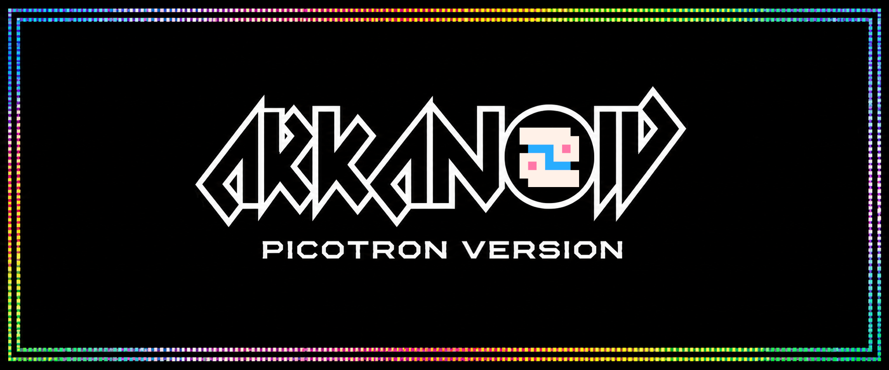

# Picotron Arkanoid

  

A faithful remake of the **Arkanoid** arcade classic built with **Picotron** using **Lua**.

The project aims to recreate the look, feel and gameplay of the original arcade while keeping the code clean, modular and easy to understand.

## Features

- Classic Arkanoid gameplay
- 15 handcrafted levels
- Multiple brick types
  - Normal
  - Silver (2 hits)
  - Indestructible Gold
- Power-ups
  - Slow Ball
  - Extra Life
  - Catch
  - Enlarge Paddle
  - Mega Ball
  - Multi Ball
  - Disruption
  - Laser
  - Break

## Controls

| Key          | Action                    |
| ------------ | ------------------------- |
| Left / Right | Move paddle               |
| X            | Launch ball / Fire lasers |
| Esc          | Quit                      |

## Running

Open the cartridge with **Picotron** and run it.

The game is designed for the **Picotron** fantasy console and is written entirely in Lua.

## Technical Highlights

- Written entirely in Lua
- Text-based level definitions
- Collision and ball deflection system
- Multiple simultaneous balls
- Power-up framework
- Paddle and ball state management
- Particle system
- Screen shake effects
- Animated sprites and effects
- Modular game state system
- Retro-inspired HUD and game presentation

## Project Status

The game is fully playable and the main gameplay systems are implemented.

The current focus is on polishing the presentation, improving the arcade experience and completing the remaining non-gameplay features.

## Roadmap

- [ ] Add more levels
- [ ] Music
- [ ] High score table
- [ ] Enemy stages
- [ ] Final polish

## Acknowledgements

Inspired by **Arkanoid** (Taito, 1986).

This project was developed as a learning exercise and as a tribute to one of the classic arcade games.

The project was also inspired by the **Pico-8 Arkanoid tutorial by Krystman**, adapted and implemented for **Picotron** using Lua.

This is a non-commercial fan project created for learning and for the love of retro games.

## License

Released under the MIT License.
