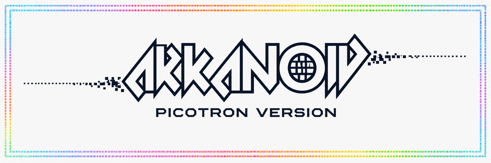

# Picotron Arkanoid

  

A faithful remake of the **Arkanoid** arcade classic built with **Picotron** using **Lua**.

The project focuses on recreating the look, feel and gameplay of the original arcade while keeping the code clean and easy to understand.

## Features

- Classic Arkanoid gameplay
- 15 handcrafted levels
- Multiple brick types
  - Normal
  - Silver (2 hits)
  - Indestructible Gold
- Power-ups
  - Slow Ball
  - Extra Life
  - Catch
  - Enlarge Paddle
  - Mega Ball
  - Multi Ball
  - Laser
  - Break
- Animated paddle
- Laser weapon
- Particle effects
- Screen shake
- Animated power-up capsules
- Retro HUD inspired by the original arcade
- Level transition screens

## Controls

| Key | Action |
|------|--------|
| Left / Right | Move paddle |
| X | Launch ball / Fire lasers |
| Esc | Quit |

## Running

Open the cartridge with **Picotron** and run it.

## Technical Highlights

- Written entirely in Lua
- Text-based level definitions
- Collision and ball deflection system
- Particle engine
- Power-up framework
- Multiple simultaneous balls
- Modular game systems (work in progress)

## Roadmap

- [x] Paddle movement
- [x] Ball physics
- [x] Brick collision
- [x] 15 levels
- [x] HUD
- [x] Power-ups
- [x] Multi-ball
- [x] Laser
- [x] Particle effects
- [x] Game Over screen
- [x] Stage Clear screen
- [ ] Title screen
- [ ] Music
- [ ] High score table
- [ ] Enemy stages
- [ ] Final polish

## Acknowledgements

Inspired by **Arkanoid** (Taito, 1986).

This is a non-commercial fan project created for learning and for the love of retro games.

## License

Released under the MIT License.
